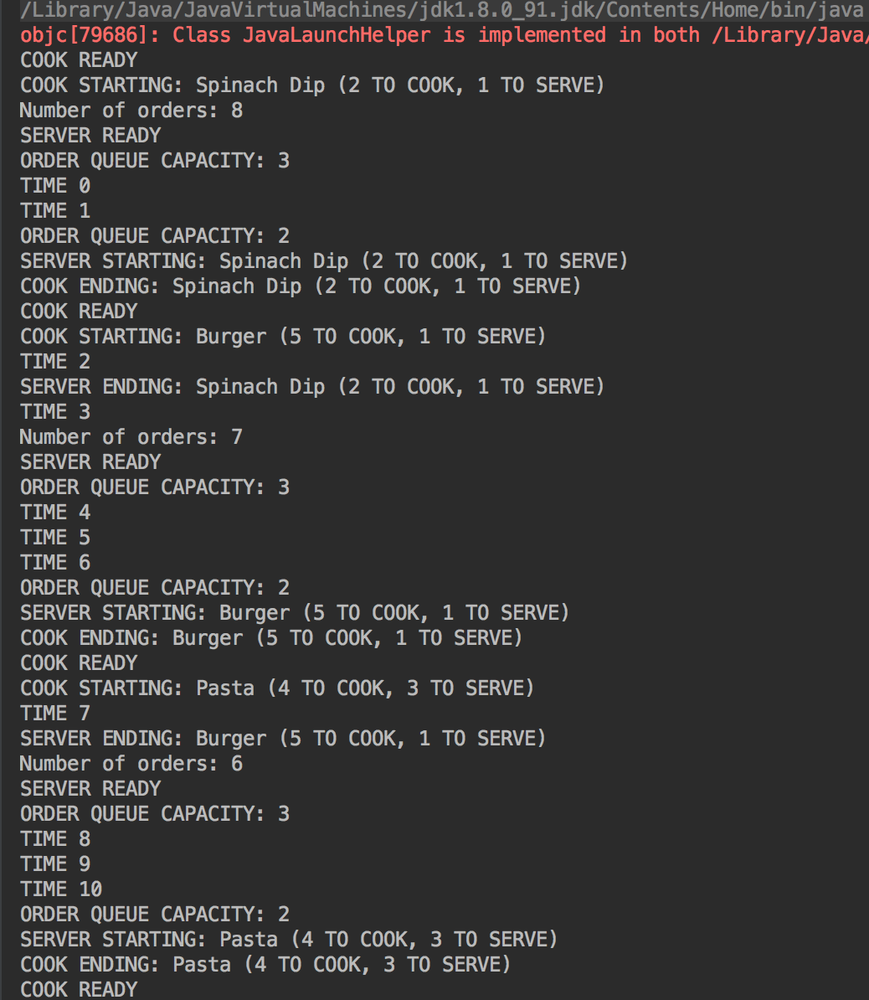
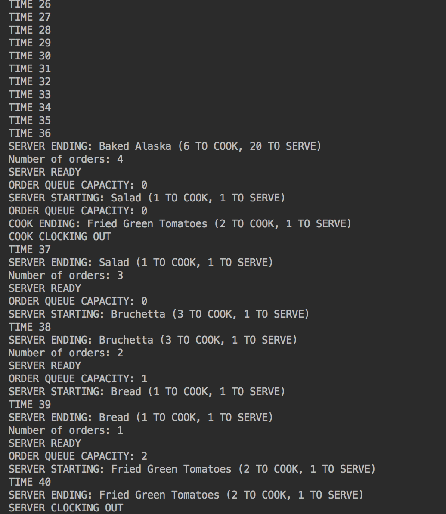

# Multithreading-Cooks-and-Servers
Create threads for a diner simulation program. This is a program that uses the 
producer/consumer relationship between cooks and servers

## Output

## Requirements
- [x] Write the thread class for the CookThread
- [x] Write the thread class for the ServeThread
- [x] Complete the FoodTester class
- [x] CookThread and ServeThread

## Instructions
Each food is described by an amount of time it takes to cook and the amount of time it takes to serve.
There is only one cook and one server.
The cook can only cook one thing at a time.
The server can only serve one thing at at time.
The cook hands food to the server to be served.
There are only three spots where the food can be placed to wait for the server.
If the cook has a fourth food ready, he/she has to wait until the server frees up a spot.
The Food and a partial FoodTester program are provided.

The CookThread should take the foodList in as a parameter.
The cook takes items from the list, cooks them, then places them to be served.
When all items from the list have been cooked, this thread can end. (The cook gets to go home!)
The ServeThread also needs to know when to stop.
You can use something as simple as the number of foods that need to be served or you can get more complex.
Use the Thread.sleep method to simulate the cook/serve time for each food.
Decide what other parameters/variables you need in these classes.

### FoodTester
Declare any shared variables you want to send to the thread classes.
Initialize and start your threads.
Use streams to complete the two printouts at the bottom.
Print the total amount of time required to cook and serve all foods.
Note that this output is not related to the threads- it's just another chance to practice streams! :)
